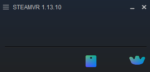

# About

This example shows minimum code of how to get raw values of tracker's position and orientation without HMD connection.
To run SteamVR without HMD, you should follow bellow

* Install each Base Station (lighthouse) separately enough like more than 2m. For details check [the official documents](https://www.vive.com/us/support/vive/category_howto/tips-for-setting-up-the-base-stations.html).
* Use [the dongle](https://www.vive.com/uk/support/wireless-tracker/category_howto/using-the-dongle.html)
* Turn `requireHmd` to `false` in `default.vrsettings` lacated `C:\Program Files (x86)\Steam\steamapps\common\SteamVR\resources\settings` (as default. Change if you installed different location)
* [Pair trackers from SteamVR](https://www.vive.com/uk/support/wireless-tracker/category_howto/pairing-vive-tracker.html)

If you did setup correctly, SteamVR looks below.

